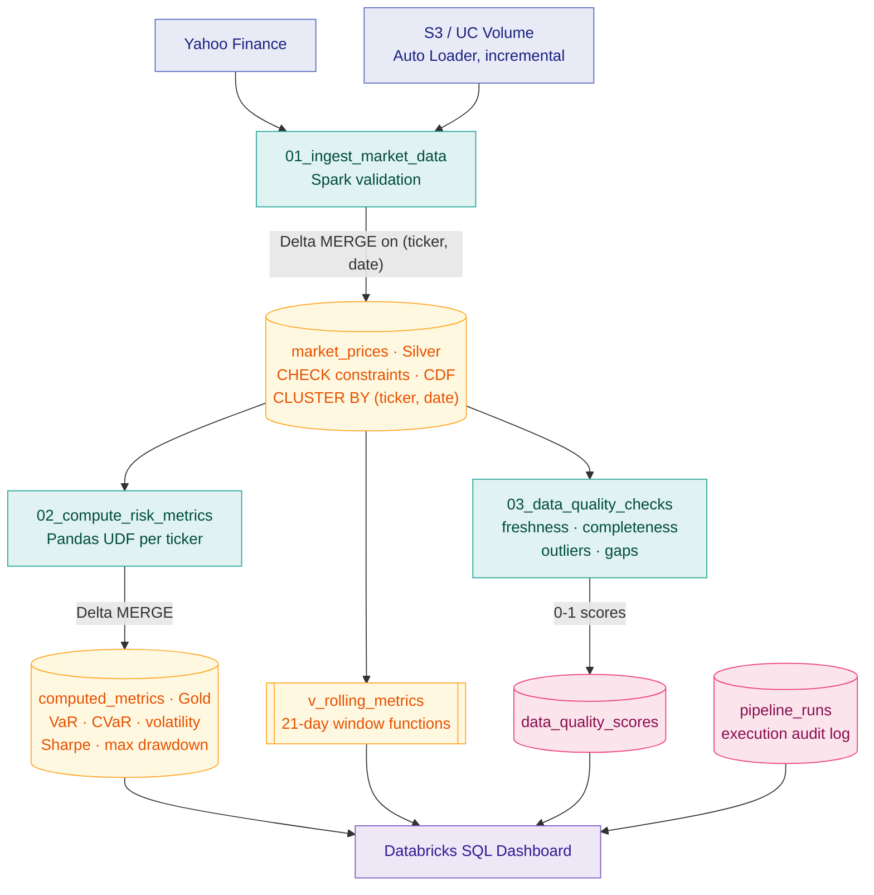
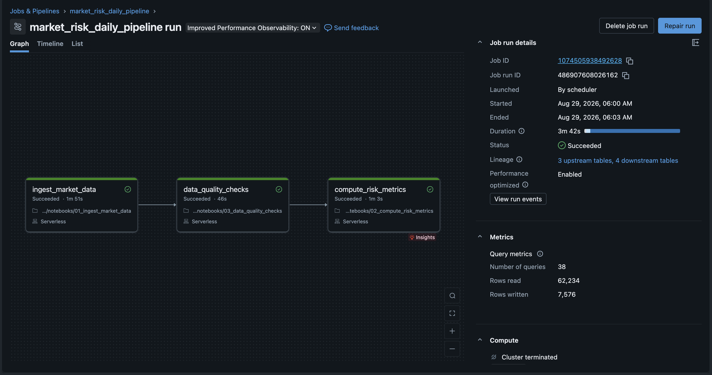
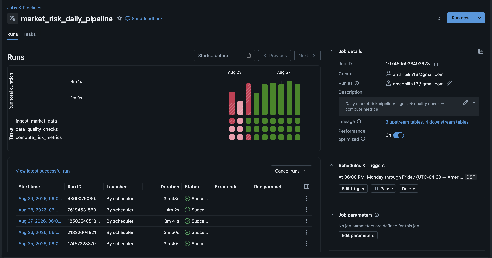
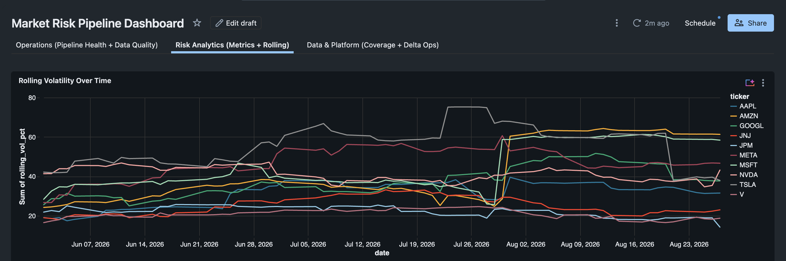
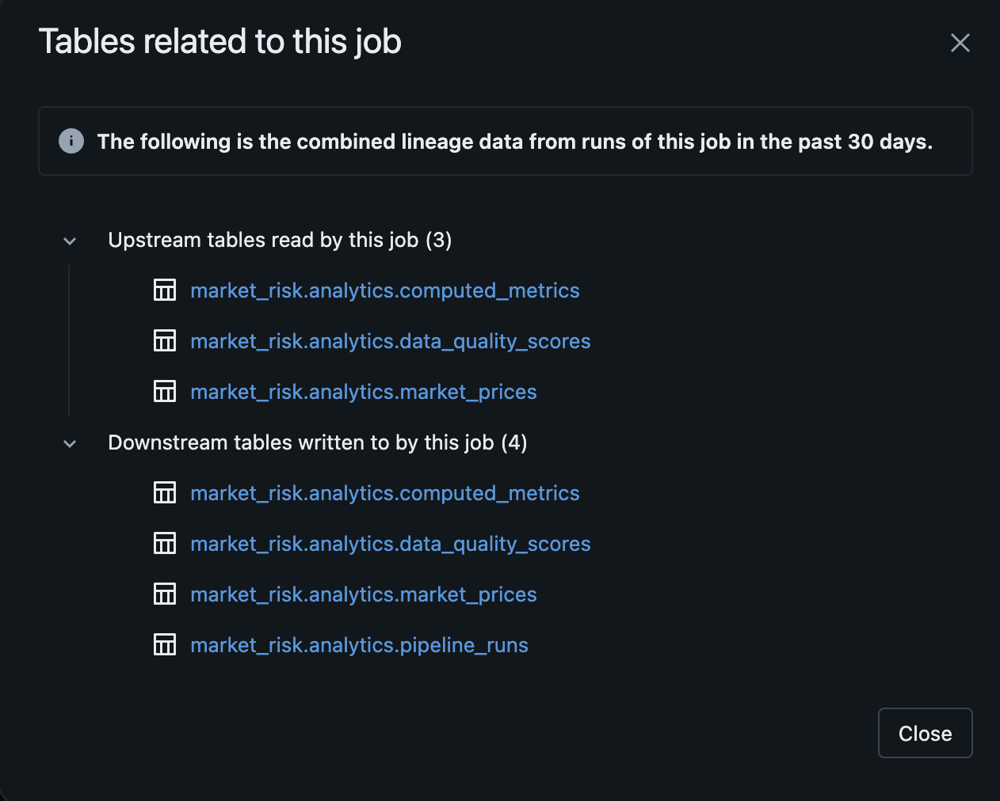

# market-risk-pipeline

A financial risk analytics pipeline with **two deployment targets**: a standalone
Python/FastAPI service and a Databricks-native implementation using Delta Lake,
Spark, and SQL Dashboards.

## Architecture

The Databricks implementation is the primary target — a medallion-layered Delta
Lake pipeline orchestrated by Databricks Workflows on serverless compute, with
run auditing and data quality scoring as first-class tables:



Tasks run in the order `ingest → quality checks → metrics`, so bad data is
scored before it reaches metric computation. Quality failures are a soft gate —
they are recorded but do not block the run.

The standalone service covers the same metric logic behind a REST API:

```
source (local CSV / S3 / Yahoo)  ->  validate  ->  SQL  ->  metrics  ->  REST + cache
```

## Quick start

```bash
make install                       # pip install -e ".[dev]"
cp .env.example .env               # optional; defaults work out of the box
make ingest                        # one ingestion pass from the configured source
make run                           # uvicorn on http://localhost:8000
```

Then open <http://localhost:8000/docs> for interactive API docs.

With Docker (brings up Redis as well):

```bash
make docker-up
```

## API

| Method | Path | Description |
| --- | --- | --- |
| `GET` | `/health` | Liveness check |
| `GET` | `/api/v1/metrics/tickers` | Tickers with stored price data (paginated) |
| `GET` | `/api/v1/metrics/{ticker}` | Risk metrics (precomputed or on-demand with date params) |
| `GET` | `/api/v1/metrics/{ticker}/returns` | Daily return series + stats |
| `GET` | `/api/v1/metrics/{ticker}/rolling` | Rolling volatility and VaR time series (`?window=21`) |
| `GET` | `/api/v1/prices/{ticker}` | Raw OHLCV price history (paginated, date-filterable) |
| `POST` | `/api/v1/ingest/` | Trigger ingestion pass (optional `?ticker=AAPL`) |
| `POST` | `/api/v1/portfolios/` | Create a named portfolio with weighted holdings |
| `GET` | `/api/v1/portfolios/` | List all portfolios (paginated) |
| `PUT` | `/api/v1/portfolios/{name}` | Update portfolio holdings |
| `DELETE` | `/api/v1/portfolios/{name}` | Delete a portfolio |
| `GET` | `/api/v1/portfolios/{name}/risk` | Compute portfolio-level risk metrics |

### Metrics endpoint

Called without dates, returns the latest metric set precomputed by the pipeline
over the ticker's full stored history:

```bash
curl localhost:8000/api/v1/metrics/AAPL
```

Called with `start_date` and/or `end_date` (ISO `YYYY-MM-DD`, both inclusive),
metrics are computed on demand from prices in that window:

```bash
curl "localhost:8000/api/v1/metrics/AAPL?start_date=2025-01-01&end_date=2025-06-30"
```

```json
{
  "ticker": "AAPL",
  "start_date": "2025-01-02",
  "end_date": "2025-06-30",
  "annualized_volatility": 0.248312,
  "var_95": 0.020281,
  "var_99": 0.031174,
  "cvar_95": 0.032215,
  "cvar_99": 0.040883,
  "sharpe_ratio": 2.014118,
  "max_drawdown": 0.138042
}
```

`start_date` and `end_date` are reported as the first and last trading day
actually present in the window, which may differ from what was requested.

Responses are cached for `MR_CACHE_TTL_SECONDS` per distinct
`(ticker, start_date, end_date)` key. CORS is enabled for all origins.

Error responses:

| Status | Condition |
| --- | --- |
| `404` | Unknown ticker, or no price data in the requested window |
| `422` | Malformed date, `start_date` after `end_date`, or fewer than 3 price points |

### Portfolio endpoints

Create a portfolio with weighted holdings (weights are normalized to sum to 1.0):

```bash
curl -X POST localhost:8000/api/v1/portfolios/ \
  -H "Content-Type: application/json" \
  -d '{"name": "tech", "holdings": [{"ticker": "AAPL", "weight": 0.6}, {"ticker": "MSFT", "weight": 0.4}]}'
```

Get portfolio-level risk metrics including diversification ratio:

```bash
curl localhost:8000/api/v1/portfolios/tech/risk
```

## Metrics

All metrics derive from simple daily returns of the closing price. Annualization
uses 252 trading days. VaR and CVaR are returned as **positive loss
magnitudes** — `var_95 = 0.02` means a 2% one-day loss at 95% confidence.

| Metric | Definition |
| --- | --- |
| `annualized_volatility` | Standard deviation of daily returns x sqrt(252) |
| `var_95` / `var_99` | Historical Value-at-Risk: the loss at the 5th / 1st return percentile |
| `cvar_95` / `cvar_99` | Conditional VaR (expected shortfall): mean loss in the tail beyond VaR |
| `sharpe_ratio` | Annualized mean excess return over standard deviation (configurable risk-free rate, default 2%) |
| `max_drawdown` | Largest peak-to-trough decline, as a positive fraction |

Portfolio-level metrics additionally include:

| Metric | Definition |
| --- | --- |
| `diversification_ratio` | Weighted average individual volatility / portfolio volatility (>1 means diversification benefit) |

A window needs at least 3 price points. Any window producing a non-finite value
is rejected rather than persisted or served.

## Configuration

All settings are read from environment variables prefixed `MR_`, or from a
`.env` file. See `.env.example`.

| Variable | Default | Notes |
| --- | --- | --- |
| `MR_DATABASE_URL` | `sqlite:///./market_risk.db` | Any SQLAlchemy URL |
| `MR_DATA_SOURCE` | `local` | One of `local`, `s3`, `yahoo` |
| `MR_LOCAL_DATA_PATH` | `./data/sample` | Directory of CSVs, for `local` |
| `MR_S3_BUCKET` | — | For `s3` |
| `MR_S3_PREFIX` | `market-data/` | For `s3` |
| `MR_AWS_REGION` | `us-east-1` | For `s3` |
| `MR_YAHOO_TICKERS` | `AAPL,MSFT,GOOGL` | Comma-separated, for `yahoo` |
| `MR_YAHOO_PERIOD_DAYS` | `365` | Lookback window, for `yahoo` |
| `MR_REDIS_URL` | — | Empty uses an in-process cache instead |
| `MR_CACHE_TTL_SECONDS` | `300` | Metrics response TTL |
| `MR_RISK_FREE_RATE` | `0.02` | Annualized risk-free rate for Sharpe ratio |
| `MR_API_HOST` / `MR_API_PORT` | `0.0.0.0` / `8000` | Server bind |

## Data sources

Sources implement the `DataSource` interface (`list_files`, `read_file`) and are
selected at runtime by `MR_DATA_SOURCE`:

- **`local`** — reads `*.csv` from `MR_LOCAL_DATA_PATH`. Sample data ships in `data/sample/`.
- **`s3`** — reads `*.csv` under `s3://$MR_S3_BUCKET/$MR_S3_PREFIX` via boto3.
- **`yahoo`** — downloads adjusted OHLCV per ticker via `yfinance`.

Expected CSV columns: `ticker,date,open,high,low,close,volume`.

Rows are validated with Pydantic before insertion — tickers are upper-cased,
volume must be non-negative, and `high` must be >= `low`. Invalid rows are
counted and skipped rather than failing the batch; the count is returned as
`errors` from the ingest endpoint.

## Layout

```
src/market_risk/
  config.py            Settings (pydantic-settings)
  ingestion/           DataSource interface + local, S3, Yahoo implementations
  schemas/             Pydantic validation and API response models
  metrics/             Metric functions; service.py assembles the full set
  database/            SQLAlchemy models, engine, repository
  pipeline/            Orchestrator (also the `make ingest` entrypoint)
  api/                 FastAPI app, routes, DI, cache backends
```

`metrics/service.py` is the single source of truth for metric computation, so
the precomputed pipeline path and the on-demand API path cannot drift apart.

## Storage

Four tables:

- **`market_prices`** — unique on `(ticker, date)`, so re-ingesting overlapping
  data is idempotent. Insertion uses native `ON CONFLICT DO NOTHING` on SQLite
  and PostgreSQL, with a pre-filtered plain insert as a fallback on other
  dialects.
- **`computed_metrics`** — unique on `(ticker, window_start, window_end)`.
  Re-running the pipeline updates the existing row for a window rather than
  appending, so the table stays bounded.
- **`portfolios`** — unique on `name`. Has many `portfolio_holdings`.
- **`portfolio_holdings`** — unique on `(portfolio_id, ticker)`. Stores the
  weight of each ticker in a portfolio.

Schema is created via `Base.metadata.create_all` at startup. There are no
migrations yet, so changing a model against an existing database needs a manual
`ALTER` or a fresh database file.

## Databricks deployment

The `databricks/` directory contains a full Databricks-native implementation
designed for production-scale runs on Delta Lake with serverless compute.

```
databricks/
├── config/setup_delta_tables.py          # Unity Catalog schema + Delta table DDL
├── notebooks/
│   ├── 01_ingest_market_data.py          # Multi-source ingestion into Delta Lake
│   ├── 02_compute_risk_metrics.py        # Risk metrics via Pandas UDFs
│   └── 03_data_quality_checks.py         # Freshness, completeness, outlier, gap checks
├── sql/dashboard_queries.sql             # 15+ queries for SQL Dashboard
└── workflows/market_risk_pipeline.json   # Scheduled DAG (ingest -> quality -> metrics)
```

Key features: Delta MERGE upserts, liquid clustering, Pandas UDFs for scalable
per-ticker computation, pipeline run auditing, data quality scoring, Auto Loader
for incremental ingestion, and a SQL Dashboard with 15+ pre-built queries.

Runs on serverless compute (no cluster management). See `project-guide.md` for
full deployment instructions and feature details.

### Orchestration

The workflow runs weekdays after market close, with retries on ingestion and
email alerts on failure. Three tasks run on serverless compute in dependency
order, end to end in well under four minutes:



That run read 62,234 rows and wrote 7,576 across 38 queries. Note *Launched: By
scheduler* — the cron trigger fires on its own rather than the run being kicked
off by hand.



The red bars are real: they are the runs it took to work through the serverless
constraints documented in `project-guide.md` (no RDD APIs, no persistent views
over temp views, no column DEFAULT values).

Every execution writes a row to `pipeline_runs` with status, duration, row
counts and captured errors. A run that dies mid-notebook never reaches its own
completion update, so each notebook reaps rows left stranded at `running` by a
previous run before registering its own — otherwise the dashboard success rate
would drift down silently while `failed_runs` stayed at zero.

### Risk metrics

The dashboard is organised into three tabs — Operations (pipeline health and
data quality), Risk Analytics (metrics and rolling series), and Data & Platform
(coverage and Delta operations):



Rolling volatility comes from a Spark window function over `market_prices`,
exposed as the `v_rolling_metrics` view.

### Lineage

Delta tables carry column comments, CHECK constraints and Change Data Feed, so
Unity Catalog captures lineage automatically from the job:



### Data quality

Four checks — freshness, completeness, outliers and date gaps — each score every
ticker from 0 to 1 into `data_quality_scores`, making quality trendable rather
than a pass/fail assertion.

<!-- Capture per docs/CAPTURE_CHECKLIST.md, then uncomment:

-->

## Development

```bash
make test                  # pytest with coverage (80% gate)
make lint                  # ruff + mypy --strict
```

CI runs tests, lint, type-check, and a Docker build on every push and PR to
`main`.

Tests use in-memory SQLite. Note that `Settings()` reads `.env` by default —
tests asserting on declared defaults pass `_env_file=None` to stay isolated from
your local config.

## Known gaps

### Standalone
- No Alembic migrations — schema changes require manual ALTER or fresh DB.
- `POST /api/v1/ingest/` runs synchronously; a large Yahoo or S3 pull blocks the request.
- Yahoo ingestion fetches one ticker per call with no rate limiting or retry.
- No auth/authorization — API is completely open.
- In-memory cache doesn't share state across workers.

### Databricks
- Batch-only (no Structured Streaming for real-time).
- Dashboard requires manual setup (no Terraform/API automation yet).
- The job runs as the creating user rather than a service principal.
- ~62k rows read per run across 10 tickers — a volume that does not yet justify the
  distributed machinery.

## Related

PySpark data cleansing exercises that used to live in this repository now sit in
[spark-exercises](https://github.com/aman-shabilin/spark-exercises) — teaching
material, kept separate from the pipeline.
